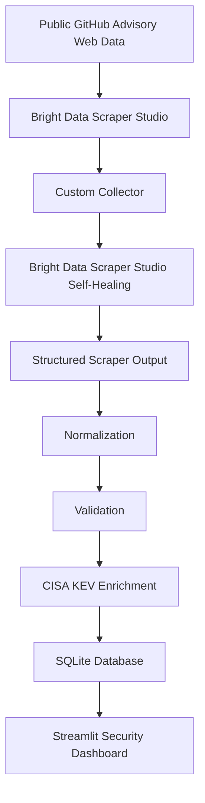
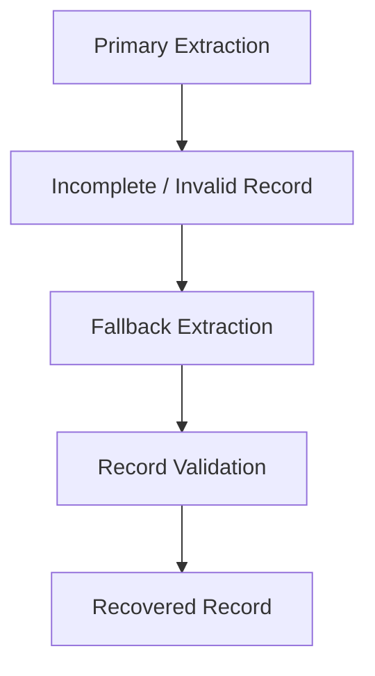

# 🛡️ Security Advisory Tracker

A security-advisory monitoring system that collects GitHub Security Advisories with a custom Bright Data scraper, normalizes and deduplicates them, flags actively exploited vulnerabilities using th[...]

**Hackathon:** Scrapeverse Hackathon by WeMakeDevs × Bright Data

🔗 **Live Demo:** https://security-advisory-tracker-4jl7zsfrvhxnunfn9c5dhc.streamlit.app/

`Python` · `Streamlit` · `SQLite` · `Bright Data` · `CISA KEV`

---

## 🚀 Live Demo

[**Open Security Advisory Tracker**](https://security-advisory-tracker-4jl7zsfrvhxnunfn9c5dhc.streamlit.app/)

The public deployment runs entirely from the committed sample fixture (50 real advisories from the actual Bright Data run). It does **not** require a Bright Data API key and exposes no secrets.

---

## 🧩 Problem

Security advisories are published continuously across many sources. Security teams need structured, searchable vulnerability information to triage fast — but raw web data is inconsistent, and sc[...]

Two additional problems make this harder:

- **Actively exploited vulnerabilities deserve prioritization.** Raw CVE feeds don't tell you which vulnerabilities are being exploited in the wild *today*.
- **Scrapers fail silently.** When a website layout changes or a field is missing, most scrapers either crash or quietly produce corrupt records.

The Security Advisory Tracker addresses these problems with a two-layer resilience approach:

1. **Scraper-level Self-Healing** (in Bright Data Scraper Studio) — makes the custom collector's extraction logic more resilient.
2. **Application-level Fallback Recovery** (in the Python app) — demonstrates graceful recovery when an extracted record is incomplete.

---

## 🛠️ Solution

The complete workflow:



Bright Data collect raw advisory records from GitHub Security Advisories. The Python pipeline normalizes and validates each record, deduplicates by CVE/GHSA ID, enriches with CISA KEV status, and [...]

---

## 🔧 Self-Healing Architecture

This project demonstrates **two separate recovery layers**.

### 1. Bright Data Scraper Studio Self-Healing

The project uses a **custom Bright Data Scraper Studio collector** built specifically for GitHub Security Advisories. During development, the built-in **Bright Data Self-Healing** feature was used[...]

**Verified production result:**

| Metric | Value |
|--------|-------|
| Records fetched | 10,000 |
| Valid records | 9,998 |
| Failed crawls | 2 |
| Success rate | **99.98%** |
| Pages fulfilled | ~10.4K |

> Note: We do not claim that this particular production run demonstrated a live website DOM/structure failure being automatically repaired. The Self-Healing feature was used during development to [...]

### 2. Application Fallback Recovery

The Streamlit application contains a **deterministic controlled demonstration** showing how the application can recover when a required field is unavailable after extraction.

```text
Application Fallback Recovery
        ↓
Controlled demonstration
        ↓
Handles missing required extracted fields
```

This demonstration simulates a primary extraction failure and shows recovery through an application-level fallback path. It is **separate from** Bright Data Scraper Studio's Self-Healing capabilit[...]

> **Important:** This is an application-level recovery demonstration. Scraper-level Self-Healing is handled by Bright Data Scraper Studio.

---

## ✨ Key Features

- **Custom Bright Data scraper** — collects GitHub Security Advisories at scale
- **Large-scale advisory collection** — 10,000 records fetched, 9,998 valid
- **Graceful handling of malformed records** — malformed records are skipped without crashing the run
- **Normalization and deduplication** — consistent schema, UPSERT by CVE/GHSA ID
- **CISA KEV enrichment** — flags known exploited vulnerabilities
- **Severity monitoring** — color-coded CRITICAL / HIGH / MODERATE / LOW breakdown
- **Patch Now section** — prominently surfaces CISA KEV flagged advisories
- **Search and filtering** — by title, CVE/GHSA ID, affected package, severity, ecosystem, and KEV status
- **Scraper health and run history** — records fetched, fallbacks, failures, and overall health in one panel
- **Application-level fallback demonstration** — a controlled process-test of the primary → fallback → recovered path
- **Bright Data Scraper Studio Self-Healing** — used during development to make extraction logic more resilient
- **Streamlit dashboard** — dark, SOC-style, responsive, and beginner friendly
- **Streamlit Community Cloud deployment** — public demo runs from a committed fixture

---

## 🚀 Bright Data Scraper Studio

### Why Bright Data?

Bright Data Scraper Studio provides the custom web-data collection layer for this project.

- The **custom collector** was created specifically for this project — it targets public GitHub Advisory data.
- **Bright Data Scraper Studio Self-Healing** was used during scraper development to refactor and improve the resilience of the extraction logic.
- The structured output from the scraper feeds the application's processing pipeline.

**Verified production run:**

- 10,000 records fetched
- 9,998 valid records
- 2 failed crawls
- 99.98% success rate
- ~10.4K pages processed

The raw Bright Data output is kept out of Git (gitignored) and is never exposed publicly.

[Visit Bright Data →](https://brightdata.com/)

---

## 📸 Screenshots

*(Screenshot files will be added here before final submission.)*

- **Main Security Advisory Tracker dashboard** — overview metrics, severity chart, Patch Now section, advisory table, scraper health, and the fallback demonstration.

  `docs/assets/dashboard.png`

- **Application Fallback Recovery demonstration** — the controlled application-level recovery flow.

  `docs/assets/self-healing.png`

- **Bright Data Scraper Studio custom scraper / Self-Healing workflow** — the custom collector and the Self-Healing feature.

  `docs/assets/brightdata-scraper.png`

- **Bright Data production run** — showing 9,998 records, 99.98% success rate, 2 failed crawls, ~10.4K pages.

  `docs/assets/brightdata-results.png`

---

## 🔄 Application Fallback Recovery

A core engineering challenge in web scraping is resilience. When an extracted record is incomplete or fails validation, the application should recover gracefully instead of crashing or silently d[...]

The application-level fallback recovery path works like this:



The dashboard includes a **controlled, deterministic fallback demonstration** (the "Application Fallback Recovery" section). It simulates an incomplete extraction on a real fixture record and sho[...]

> **Note:** This is an application-level fallback demonstration. Scraper-level Self-Healing is handled by Bright Data Scraper Studio.

---

## 📚 Documentation

Detailed technical documentation lives in the repository:

- [**Architecture**](docs/ARCHITECTURE-Security-Advisory-Tracker.md)
- [**Database Schema**](docs/Database%20Schema%20Design.md)
- [**Product Requirements Document**](docs/PRD-Security-Advisory-Tracker.md)
- [**API Specification**](docs/API%20Specification.md)

---

## 🧰 Tech Stack

| Layer | Technology | Purpose |
|-------|------------|---------|
| **Language** | Python 3.11+ | Scraper, pipeline, dashboard |
| **Data Collection** | Bright Data Scraper Studio | Custom scraper for GitHub Advisories + Self-Healing |
| **Frontend UI** | Streamlit | Dashboard, charts, filters |
| **Database** | SQLite (built-in `sqlite3`) | Single-file relational storage |
| **Enrichment** | CISA KEV JSON feed (requests) | Known-exploited flags |
| **Data Processing** | `requests`, `pandas`, `pathlib` | Normalize, enrich, deduplicate, persist |

---

## 📁 Project Structure

```
security-advisory-tracker/
├── app.py                     # Streamlit dashboard
├── requirements.txt           # Python dependencies
├── README.md                  # This file
├── .env.example               # Env template (never commit .env)
├── data/
│   ├── db.py                  # SQLite connection layer
│   └── sample_scraper_output.json   # Committed 50-record fixture
├── docs/
│   ├── ARCHITECTURE-Security-Advisory-Tracker.md
│   ├── Database Schema Design.md
│   ├── PRD-Security-Advisory-Tracker.md
│   ├── API Specification.md
│   └── assets/                    # Screenshots
├── pipeline/
│   ├── run_pipeline.py         # Orchestrator
│   ├── normalize.py            # Validation / GHSA fallback
│   └── enrich_kev.py           # CISA KEV enrichment
└── scraper/
    ├── run_scraper.py          # Fixture/live loader + fallback demo
    └── config.py               # Output contract / constants
```

---

## 💻 Installation / Local Setup

1. **Clone the repository:**
   ```bash
   git clone https://github.com/krithikashree1957/Security-Advisory-Tracker.git
   cd Security-Advisory-Tracker
   ```

2. **Create a virtual environment (recommended):**
   ```bash
   python -m venv venv
   source venv/bin/activate   # Windows: venv\Scripts\activate
   ```

3. **Install dependencies:**
   ```bash
   pip install -r requirements.txt
   ```

> **No Bright Data API key is required** for local development. The app bootstraps from the committed fixture when no database exists, and uses an existing populated database (such as your local [...]

---

## ▶️ Running Locally

```bash
streamlit run app.py
```

The dashboard opens at `http://localhost:8501`.

- If `data/advisories.db` does not exist, the app automatically bootstraps from `data/sample_scraper_output.json` (50 real advisories).
- Existing populated databases are preserved and used directly.

To run the pipeline manually:

```bash
python -m pipeline.run_pipeline --mode fixture
python -m pipeline.run_pipeline --mode live    # requires data/brightdata_output.json
```

---

## ☁️ Deployment

This project is deployed to **Streamlit Community Cloud**.

- Public demo runs on the committed 50-record fixture — **no Bright Data API key required**.
- On a fresh deployment, `app.py` detects the missing database and bootstraps from the fixture.
- The deployed database is ephemeral and re-bootstraps on each cold start.
- Secrets (`.env`, API keys) must **never** be committed — they are gitignored.

To deploy your own copy: push to GitHub → [share.streamlit.io](https://share.streamlit.io) → New app → main file `app.py` → Deploy.

---

## 🔄 Data Flow

1. **Collect** — Bright Data runs the custom collector on public GitHub Advisory data.
2. **Validate** — `scraper/run_scraper.py` checks every record against required fields; malformed records are counted and skipped without crashing.
3. **Normalize / Deduplicate** — `pipeline/normalize.py` maps raw records to database schema and falls back to GHSA IDs when CVE IDs are missing.
4. **Enrich** — `pipeline/enrich_kev.py` merges CISA KEV known-exploited status (`in_cisa_kev = 1` → "Patch Now").
5. **Persist** — `data/db.py` writes to SQLite (UPSERT) and logs run metadata.
6. **Present** — `app.py` reads SQLite and renders the dashboard.

---

## 🎥 Demo Video

> Demo video will be added before final submission.

---

## 🏆 Hackathon Story

### Problem

Security advisories are continuously published and require fast triage.

### Solution

Security Advisory Tracker collects public GitHub advisory data through a custom Bright Data Scraper Studio collector, processes and enriches the data, and presents it through a security-focused d[...]

### Why Bright Data

Bright Data Scraper Studio provides the custom web-data collection layer, and its Self-Healing capability improves the resilience of the extraction logic.

### Application intelligence

The application then normalizes, validates, enriches, stores, and visualizes the collected data.

---

## 🧭 Demo Flow

1. Open the live dashboard.
2. Show overall advisory metrics.
3. Demonstrate severity/search/filter functionality.
4. Show advisory records.
5. Show Scraper Health and Bright Data run statistics.
6. Explain the Bright Data Scraper Studio Self-Healing layer.
7. Trigger the Application Fallback Recovery demonstration.
8. Explain the difference between scraper-level Self-Healing and application-level fallback recovery.

---

## 📊 Results

Real collection statistics from the Bright Data run:

| Metric | Value |
|--------|-------|
| Records fetched | 10,000 |
| Valid records | 9,998 |
| Failed crawls | 2 |
| Success rate | **99.98%** |
| Pages fulfilled | ~10.4K |

> **Important:** The public demo presents the committed **50-record fixture** (a safe subset of the real Bright Data output). The full 9,998-record dataset is used locally in the original pipelin[...]

---

## 🔜 Future Improvements

- Multiple fallback strategies beyond the current single fallback path
- Real-time alerting / notifications for newly added KEV CVEs
- Historical trend tracking (vulnerability data over time)
- Automated scheduling (cron / GitHub Actions)
- CSV / JSON export
- NVD / OSV.dev integration plus EPSS / SSVC scoring

---

## License

This project is licensed under the MIT License. See the [LICENSE](LICENSE) file for details.

## AI Assistance Disclosure

AI coding assistants were used selectively during development, including Cline, for limited scaffolding, debugging, code suggestions, and documentation assistance. The project architecture, imple[...]

---

**Built with ❤️ for the Scrapeverse Hackathon**

---

Krithika Shree K

Project: Security Advisory Tracker

GitHub: [@krithikashree1957](https://github.com/krithikashree1957)
